# Apache 01

## Tabla de Contenidos

- [Explicación](#explicación)
- [Dominios](#dominios)
- [Configuración por defecto](#configuración-por-defecto)
- [yahya.com](#yahacom)
- [www.elhadri.com](#wwwelhadricom)
- [seguro.net](#seguronet)
- [seguro.net/secreto](#seguronetsecreto)
- [Hosts](#hosts)
- [Docker-compose](#docker-compose)
- [Ejecución](#ejecución)

## Explicación

Hemos hecho el despliegue de tres dominios diferentes utilizando un servidor Apache. Utilizamos OpenSSL, Docker y Apache.

## Dominios

- yahya.com
- www.elhadri.com
- seguro.net

## Configuración por defecto

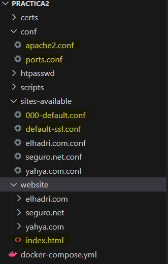
Antes de empezar, tenemos que tener la configuración por defecto de nuestro servidor Apache, a la cual le añadimos en la carpeta `conf` los puertos y el `apache2.conf`. También añadimos en `sites-available` el `000-default.conf`, que sería el primero que nos coge en caso de que no encuentre una configuración, ya que empieza por `000`. También añadimos el `default-ssl`, ya que vamos a utilizar SSL. Y por último, añadimos al sitio web una página HTML por defecto.

## yahya.com

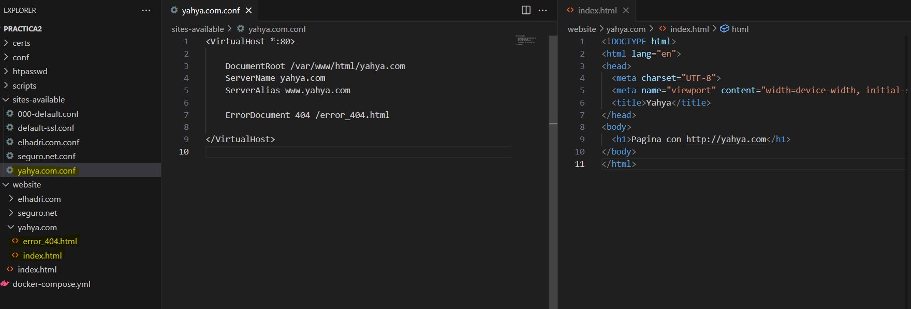
El primer paso que debemos hacer es crear, dentro de nuestra carpeta `website`, la carpeta que va a incluir nuestros HTML, en nuestro caso el `index` y el `error404`.

Una vez tenemos nuestro dominio en `website`, vamos a la carpeta de `sites-available` y creamos el Virtual Host para nuestro dominio, definimos el nombre del servidor, su alias y, en caso de algún error, dónde redireccionarlo.

## www.elhadri.com

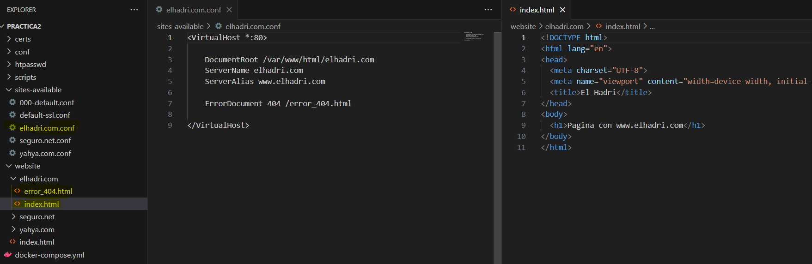
Son los mismos pasos que en la primera de yahya.com. El primer paso que debemos hacer es crear, dentro de nuestra carpeta `website`, la carpeta que va a incluir nuestros HTML, en nuestro caso el `index` y el `error404`.

Una vez tenemos nuestro dominio en `website`, vamos a la carpeta de `sites-available` y creamos el Virtual Host para nuestro dominio, definimos el nombre del servidor, su alias y, en caso de algún error, dónde redireccionarlo.

## seguro.net

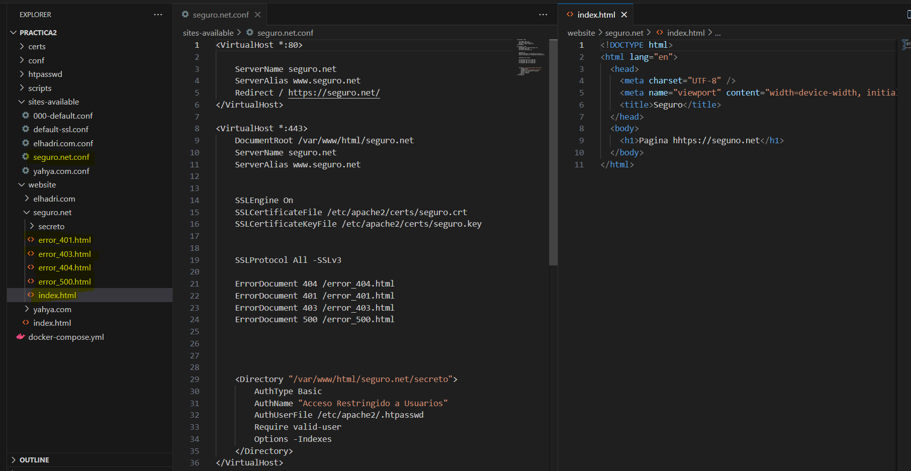
Para seguro.net, son los mismos pasos que las otras dos. Añadimos nuestros HTML a `website` y, en nuestro Virtual Host, tenemos que hacerle como un mapeo para que, en caso de que nos entre por el puerto 80, lo redirijamos al 443, que es el que nos interesa, ya que es el de una conexión segura con SSL.

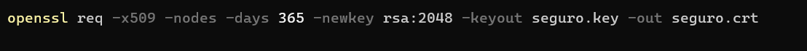
Para tener nuestra conexión segura, necesitamos tener nuestros certificados, los cuales tenemos que generar con este comando. Una vez los genera, nos los deja automáticamente en C. Nosotros tenemos que copiarlos a nuestra carpeta de `certs` en nuestro proyecto.

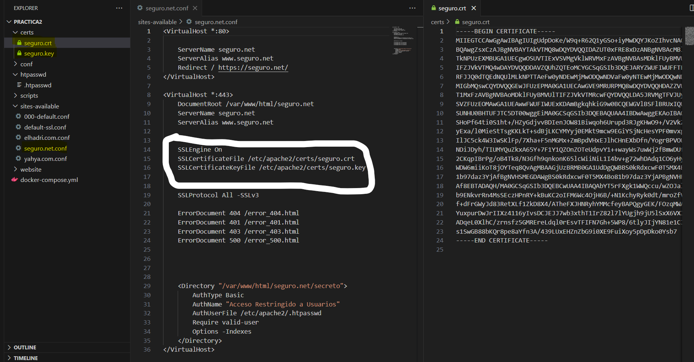
Para poder añadir estos certificados a nuestro Virtual Host, tenemos que añadir las líneas de `SSLEngine On` e indicarle dónde están nuestros certificados.

## seguro.net/secreto

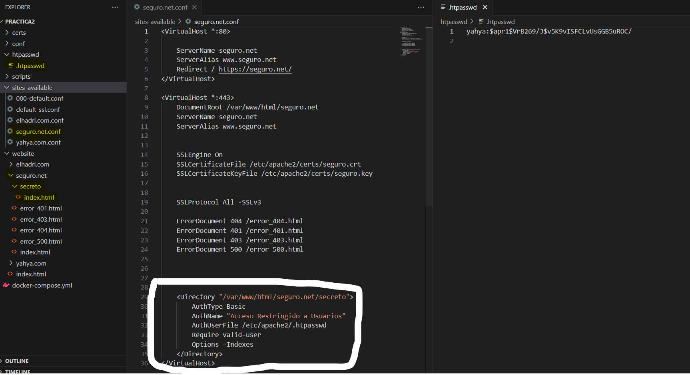
Nos queda el último paso, que es añadir nuestra página secreta, la cual queremos que tenga un usuario y contraseña. Para ello, añadimos nuestro HTML y nos vamos al `conf` de nuestro dominio que es seguro.net. En el Virtual Host, añadimos las líneas de donde queremos que sea obligatorio que el usuario esté previamente registrado para poder acceder a la página. Esa contraseña tiene que estar cifrada, porque si no, cualquiera podría acceder.

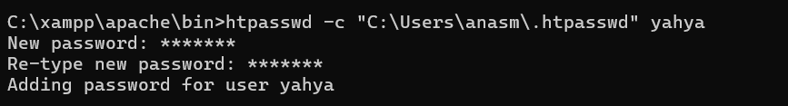

Este es el comando que necesitamos para crear nuestra contraseña. Yo lo tengo creado en mi directorio personal y luego lo corto y lo pego en el del proyecto porque me daba problemas al hacerlo directamente en mi proyecto.

## Hosts

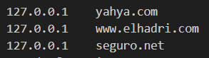

El último paso, antes del `docker-compose`, es cambiar nuestros hosts y añadir los nuevos dominios.

## Docker-compose

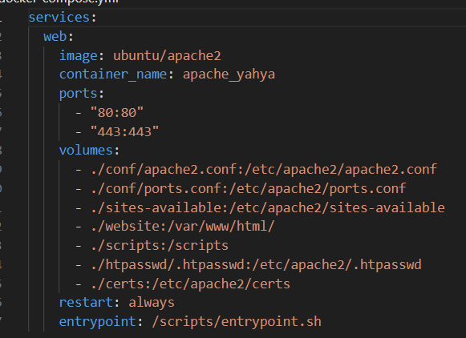
En el Docker, creamos nuestro servicio web, le indicamos nuestra imagen que vamos a utilizar. Le damos el nombre del contenedor, mapeamos los puertos, que son el del Apache y el del SSL. Indicamos también qué directorios queremos copiar y dónde los queremos. Y por último, ejecutamos nuestro script siempre que inicie el contenedor.

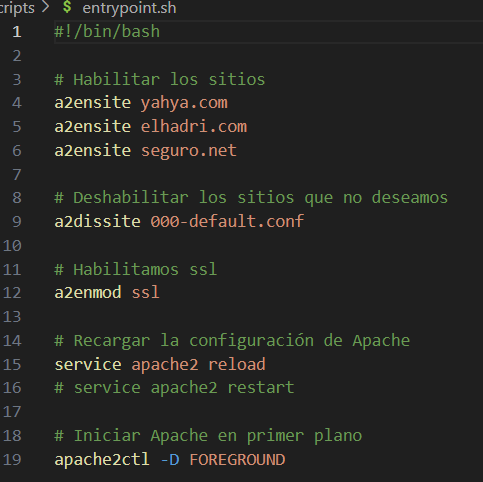

## Ejecución

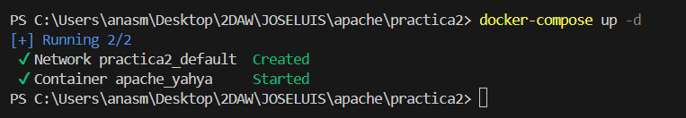
Lanzamos el `docker-compose up`.

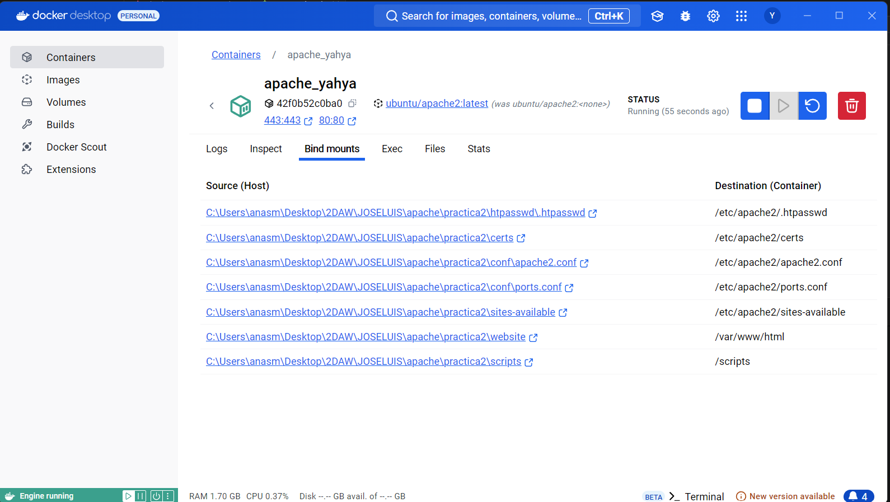
Comprobamos desde Docker Desktop y vemos los directorios nuevos del contenedor y el origen, es decir, lo que hemos puesto en `volumes` en el `docker-compose`.

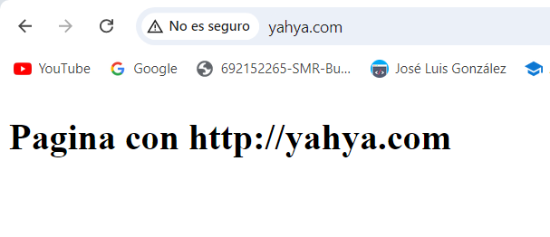
Comprobamos que yahya.com funciona.

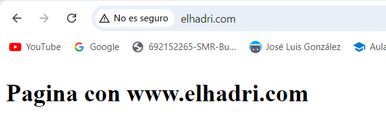
Comprobamos que elhadri.com funciona.

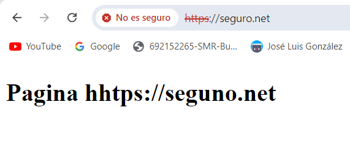
Comprobamos que seguro.net funciona y nos recoge también nuestro certificado.

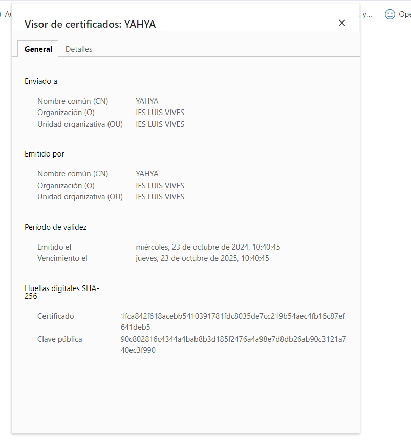

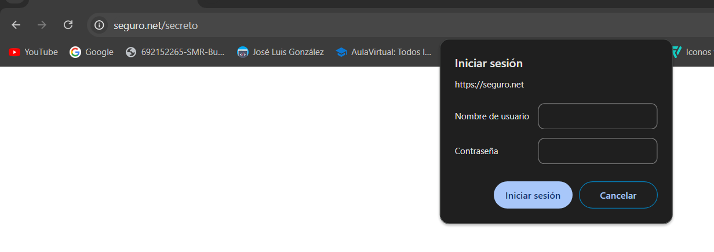
Comprobamos que seguro.net/secreto funciona y nos pide iniciar sesión con nuestro usuario y contraseña. Y funciona.

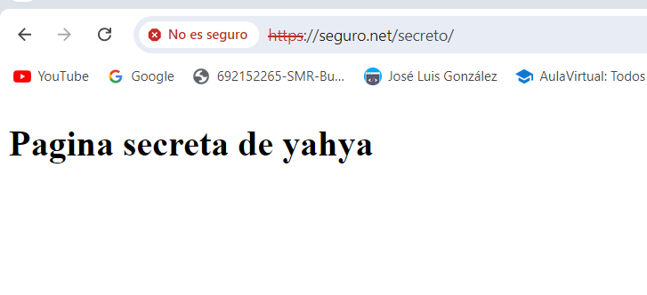

